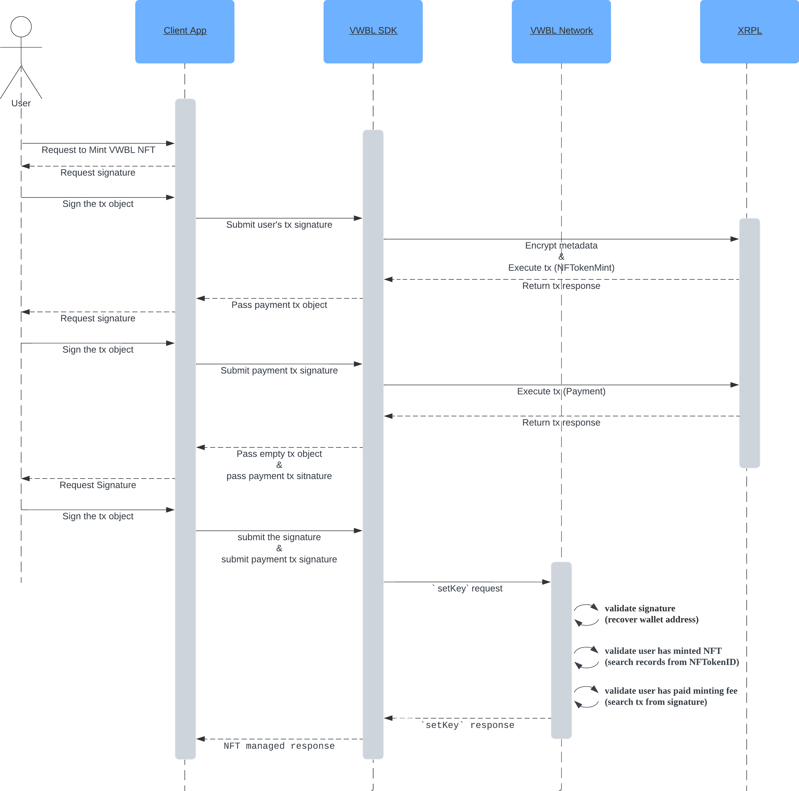

# VWBL SDK for XRPL

## official document

https://docs.vwbl-protocol.org

### install

##### Using NPM

`npm install vwbl-sdk-xrpl`

##### Using Yarn

`yarn add vwbl-sdk-xrpl`

### Build

`npm run build:xrpl`

### Test

`npm run test:xrpl`

## api document

### create instance

```typescript
const vwblXrpl = new VWBLXRPL({
  xrplChainId: 0, // Mainnet:0 / Testnet:1 / Devnet:2
  vwblNetworkUrl: "https://vwbl.network",
  uploadContentType: UploadContentType.S3,
  uploadMetadataType: UploadMetadataType.S3,
  awsConfig: {
    region: "ap-northeast-1",
    idPoolId: "ap-northeast-1:...",
    cloudFrontUrl: "https://xxx.cloudfront.net",
    bucketName: {
      metadata: "vwbl-metadata",
      content: "vwbl-content",
    },
  },
});
```

Constructor Options

| name               | required                                                 | type               | description                                                                |
| ------------------ | -------------------------------------------------------- | ------------------ | -------------------------------------------------------------------------- |
| xrplChainId        | true                                                     | number             | XRPL public server type                                                    |
| vwblNetworkUrl     | true                                                     | string             | VWBL network's url                                                         |
| uploadContentType  | flase                                                    | UploadContentType  | where to upload content, you can choose from <br> S3 <br> IPFS <br> CUSTOM |
| uploadMetadataType | flase                                                    | UploadMetadataType | where to upload content, you can choose from <br> S3 <br> IPFS <br> CUSTOM |
| awsConfig          | true if you choose to upload content or metadata to S3   | AWSConfig          | AWSConfig \*1                                                              |
| ipfsConfig         | true if you choose to upload content or metadata to IPFS | IPFSConfig         | IPFSConfig \*2                                                             |

AWSConfig(\*1)

| name          | required | type                                | description                                               |
| ------------- | -------- | ----------------------------------- | --------------------------------------------------------- |
| region        | true     | string                              | AWS region                                                |
| idPoolId      | true     | string                              | idPoolId which has granted S3-put-object                  |
| cloudFrontUrl | true     | string                              | cloudFront url connect to s3 which is uploaded content    |
| bucketName    | true     | {content: string, metadata: string} | bucketName of metadata and content, it's ok they are same |

IPFSConfig(\*2)

| name      | required | type   | description    |
| --------- | -------- | ------ | -------------- |
| apiKey    | true     | string | API key        |
| apiSecret | false    | string | API secret key |

|

## SDK



### get user's signature before minting VWBL NFT

```typescript
await vwblXrpl.generateMintTokenTx(
  walletAddress, // user's wallet address
  transferRoyalty,
  isTransferable,
  isBurnable
);
```

### mint VWBL NFT

```typescript
await vwblXrpl.mintAndGeneratePaymentTx(
  signedMintTx, // signed tx of `generateMintTokenTx`
  walletAddress
);
```

### pay mint fee

```typescript
await vwblXrpl.payMintFee(
  walletAddress,
  signedPaymentTx // signed tx of `mintAndGeneratePaymentTx`
);
```

### create token

```typescript
await vwbl.managedCreateToken(
  tokenId,
  xrplChainId,
  signedEmptyTx,
  signedPaymentTxHash,
  signerPublicKey,
  name,
  description,
  plainFile,
  thumbnailImage,
  encryptLogic="base64",
  uploadEncryptedFileCallback?,
  uploadThumbnailCallback?,
  uploadMetadataCallBack?
);
```

### view contents ( get NFT metadata from given tokenId)

```typescript
const token = await vwbl.getTokenById(tokenId);
```
